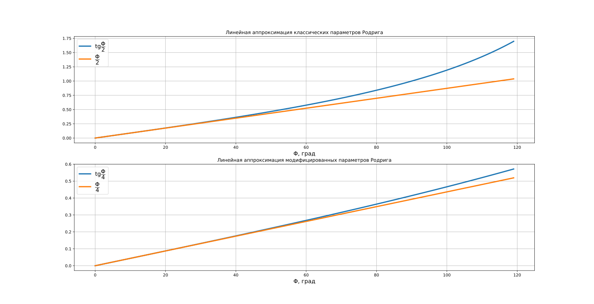

# 10. Модифицированные параметры Родрига

**Модифицированные параметры Родрига** - трехкомпонентное представление ориентации, тесное связанное с кватернионами. Они определяются следующим образом:

$$
\sigma_i = \dfrac{q_i}{1 + q_0},\ i=1,2,3,
$$

или в векторной форме:

$$
\overline{\sigma} = \text{tg} \dfrac{\Phi}{4} \overline{e},
$$

где $\Phi$ - угол поворота, а $\overline{e}$ - единичный вектор, задающий ось поворота.

В отличие от классических параметров Родрига, в знаменателе присутствует дополнительное слагаемое $+1$, улучшающее численную устойчивость и расширяющее область корректного применения.

**Обратное преобразование к кватернионам:**

$$
\begin{cases}
q_0 = \dfrac{1 - |\overline{\sigma}|^2}{1 + |\overline{\sigma}|^2}, \\
q_i = \dfrac{2 \sigma_i}{1 + |\overline{\sigma}|^2},
\end{cases}
$$

где $|\overline{\sigma}|^2 = \sigma_1^2 + \sigma_2^2 + \sigma_3^2$ - квадрат нормы вектора $\overline{\sigma}$.

**Связь c классическими параметров Родрига:**

$$
\overline{\beta} = \dfrac{2\overline{\sigma}}{1 - |\overline{\sigma}|^2},\ \ \ \ \ \overline{\sigma} = \dfrac{\overline{\beta}}{1 + \sqrt{1 + \overline{\beta}^T \cdot \overline{\beta}}}.
$$

## 10.1. Свойства модифицированных параметров Родрига

1) **Вырождение.**

   Модифицированные параметры Родрига вырождаются при $q_0 = -1$, что соответствует повороту на $\Phi = 360^{\circ}$. Хотя этот случай формально эквивалентен нулевому повороту, в некоторых прикладных задачах, например при подсчете количества полных оборотов спутника, его необходимо обрабатывать явно, чтобы избежать потери информации.

2) **Почему не использовать другой знаменатель?**

   Можно задаться вопросом: что если использовать в знаменателе, например, $2 + q_0$ вместо $1 + q_0$​? Формально это исключает вырождения. Оказывается, что при этом одна и та же комбинация параметров будет соответствовать двум различным ориентациям, что делает такую модель описания ориентации неоднозначной и непрактичной.

3) **Длинный поворот.**

   Для ориентации, описывающей длинный поворот, модифицированные параметры выражаются как:

$$
\sigma_i' = \dfrac{-q_i}{1 - q_0} = \dfrac{-\sigma_i}{|\overline{\sigma}|^2},\ i=1,2,3.
$$

   То есть каждая ориентация имеет два представления, как и в случае с кватернионами.

4) **Геометрическая интерпретация длины вектора.**

   Норма вектора $\overline{\sigma}$ напрямую связана с углом поворота:

$$
\begin{cases}
|\overline{\sigma}| < 1\ \rightarrow\ \Phi < 180^{\circ}, \\
|\overline{\sigma}| > 1\ \rightarrow\ \Phi > 180^{\circ}, \\
|\overline{\sigma}| = 1\ \rightarrow\ \Phi = 180^{\circ}. \\
\end{cases}
$$

   Таким образом, можно отличать короткий и длинный пути поворота. Это свойство особенно полезно при моделировании, поскольку позволяет управлять выбором представления с минимальной нормой и избегать деления на ноль.

5) **Линейная аппроксимация.** 

   При малых углах поворота модифицированные параметры Родрига приближаются выражением:

$$
\overline{\sigma} \approx \dfrac{\Phi}{4} \overline{e}.
$$

   В сравнении с классическими параметрами Родрига, модифицированные обладают более широкой областью линейности. Это видно по графику:



## 10.2. Связь МНК с модифицированными параметрами Родрига

Матрица направляющих косинусов (**МНК**) в явном виде имеет достаточно громоздкое выражение. Поэтому здесь она приводится в компактной матричной форме через модифицированные параметры Родрига:

$$
\textbf{C} = \textbf{I}_{3 \times 3} + \dfrac{8[\tilde{\sigma}]^2 - 4 (1 - |\overline{\sigma}| ^ 2)[\tilde{\sigma}]}{(1 + |\overline{\sigma}| ^ 2) ^ 2},
$$

где $\textbf{I}_{3 \times 3}$ - единичная матрица размера $3 \times 3$,

 $|\overline{\sigma}|^2 = \sigma_1^2 + \sigma_2^2 + \sigma_3^2$ - квадрат нормы вектора $\overline{\sigma}$,

$[\tilde{\sigma}]=\begin{pmatrix} 0 & -\sigma_{3} & \sigma_{2} \\ \sigma_{3} & 0 & -\sigma_{1} \\ -\sigma_{2} & \sigma_{1} & 0\end{pmatrix}$ - кососимметрическая матрица.

Пример метода расчета **МНК** по модифицированным параметрам Родрига на языке **Python**:

```python
import numpy as np  
  
  
def dcm_from_mrp(sigma: np.ndarray) -> np.ndarray:  
    """Расчет матрицы поворота по модифицированным параметрам Родрига."""  
    sigma_skew = np.array(  
        [  
            [0, -sigma[2], sigma[1]],   
            [sigma[2], 0, -sigma[0]],   
            [-sigma[1], sigma[0], 0]  
        ]  
    )  
    sigma_norm2 = np.sum(sigma**2)  
    dcm = 8 * sigma_skew @ sigma_skew - 4 * (1 - sigma_norm2) * sigma_skew  
    dcm /= (1 + sigma_norm2) ** 2  
    dcm += np.eye(3)  
    return dcm
```

Как и в случае с классическими параметрами Родрига, соответствующая матрица поворота обладает следующими интересным свойством:

$$
\textbf{C}(\overline{\sigma})^{-1} = \textbf{C}(\overline{\sigma})^T = \textbf{C}(-\overline{\sigma}).
$$

## 10.3. Связь модифицированных параметров Родрига с МНК

Если известна матрица $\textbf{C}$, модифицированные параметры Родрига можно определить по следующей формуле:

$$
\overline{\beta} = \dfrac{1}{\zeta(\zeta + 2)}
\begin{pmatrix}
	\textbf{C}_{23} - \textbf{C}_{32} \\
	\textbf{C}_{31} - \textbf{C}_{13} \\
	\textbf{C}_{12} - \textbf{C}_{21} \\
\end{pmatrix},
$$

где $\zeta = \sqrt{\text{tr}[\textbf{C}] + 1} = \dfrac{q_0}{2}$,

$\text{tr}[\textbf{C}] = \textbf{C}_{11} + \textbf{C}_{22} + \textbf{C}_{33}$ - след матрицы $\textbf{C}$.

## 10.4. Сложение поворотов

Пусть заданы два последовательных поворота, описываемых векторами $\overline{\sigma}'$ и $\overline{\sigma}''$. Тогда результирующий поворот $\overline{\sigma}$ определяется следующим выражением:

$$
\overline{\sigma} = \dfrac{(1 - |\overline{\sigma}'|^2\overline{\sigma}'' + (1 - |\overline{\sigma}''|^2\overline{\sigma}') - 2\overline{\sigma}'' \times \overline{\sigma}'}{1 + |\sigma'|^2 |\sigma''|^2 - 2 \overline{\sigma}' \cdot \overline{\sigma}''}.
$$

Для предотвращения вырождения необходимо контролировать величину знаменателя. В случае его приближения к нулю можно заменить один из поворотов на эквивалентный поворот, но в противоположном направлении $\Phi - 2\pi$.

Сложение поворотов также можно определить через перемножение соответствующих **МНК**.

## 10.5. Кинематические уравнения

Связь между угловой скоростью вращения космического аппарата и производной вектора модифицированных параметров Родрига задается следующим образом:

$$
\dot{\overline{\sigma}} =
\dfrac{1}{4}
\begin{pmatrix}
1 - |\overline{\sigma}|^2 + 2\sigma_1^2 & 2(\sigma_1\sigma_2 - \sigma_3) & 2(\sigma_1\sigma_3 + \sigma_2) \\
2(\sigma_1\sigma_2 + \sigma_3) & 1 - |\overline{\sigma}|^2 + 2\sigma_2^2 & 2(\sigma_2\sigma_3 - \sigma_1) \\
2(\sigma_1\sigma_3 - \sigma_2) & 2(\sigma_2\sigma_3 + \sigma_1) & 1 - |\overline{\sigma}|^2 + 2\sigma_3^2 \\
\end{pmatrix}
\overline{\omega}^{\text{B}}_{\text{B}/\text{I}}.
$$

Легко заметить, что для малых углов поворота кинематические уравнения принимают следующий вид:

$$
\dot{\overline{\sigma}} \approx
\dfrac{1}{4}
\overline{\omega}^{\text{B}}_{\text{B}/\text{I}}.
$$

## 10.6. Заключение

Модифицированные параметры Родрига - эффективный и компактный способ представления ориентации в трехмерном пространстве.

Они обеспечивают численную устойчивость, удобство линейной аппроксимации и тесную связь с кватернионами. Несмотря на наличие вырождения при $\Phi = 360^{\circ}$, оно легко устраняется за счёт перехода к альтернативному представлению. Благодаря ряду преимуществ, модифицированные параметры Родрига широко применяются в задачах моделирования и управления движением космических аппаратов.
