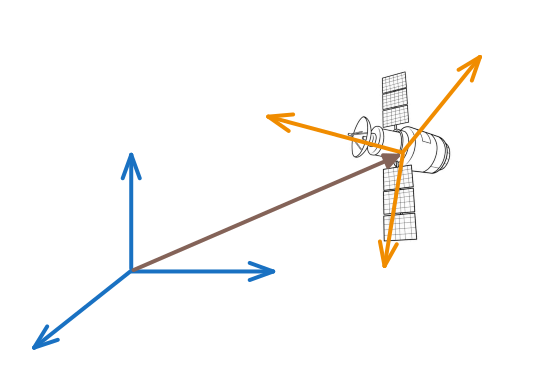

# 2. Обозначения

В дальнейшем будем использовать понятия **вектор** и **система координат**. Прежде чем двигаться дальше, уточним обозначения, которые будут применяться в тексте.

## 2.1. Системы координат

При описании углового положения спутника важно четко понимать, относительно чего рассматривается ориентация, то есть формально - как одна система координат повернута относительно другой. Существует бесконечное множество способов задания систем координат с помощью правых троек единичных векторов (ортов). На практике обычно выбирают системы координат, исходя из общепринятых стандартов, конструктивных особенностей или удобства дальнейших расчетов. В дальнейшем изложении будем предполагать, что все системы координат определены.

Мы будем использовать, в основном, две системы координат:

1. **Инерциальная система координат (ИСК) $\text{I}$** (от слова *inertial*), задаваемая ортами $\overline{i}_{1}, \overline{i}_{2}, \overline{i}_{3}$. Согласно первому закону Ньютона, инерциальной считается система, которая не ускоряется. В нашем повествовании для простоты будем считать, что ИСК представляет собой некоторую базовую неподвижную систему координат, относительно которой анализируется движение. 

   В реальных задачах **ИСК** часто совпадает с системой [J2000](https://en.wikipedia.org/wiki/Earth-centered_inertial)  (экваториальная система с фиксацией на эпоху 2000 года).

2. **Связанная система координат (ССК) $\text{B}$** (от слова *body*), задаваемая ортами $\overline{b}_{1}, \overline{b}_{2}, \overline{b}_{3}$. Эта система координат жестко связана со спутником и задается, исходя из его конструкции.

## 2.2. Векторы

Векторы будем обозначать стандартно: $\overline{r}$. При этом, если вектор задан координатами, важно указать, в какой системе координат эти координаты представлены. Для этого будем использовать следующие обозначения:

- $\overline{r}^{\text{B}}=(r_{x},\ r_{y},\ r_{z})$ или $\overline{r}=r_{x}\overline{b}_{1} + r_{y}\overline{b}_{2} + r_{z}\overline{b}_{3}$ - координаты вектора $\overline{r}$ заданы в проекциях на оси ССК (об этом говорит правый верхний индекс $\text{B}$ или орты $\overline{b}_i|_{i=1,2,3}$).
- $\overline{r}^{\text{I}}=(r_{x},\ r_{y},\ r_{z})$ или $\overline{r}=r_{x}\overline{i}_{1} + r_{y}\overline{i}_{2} + r_{z}\overline{i}_{3}$ - координаты вектора $\overline{r}$ заданы в проекциях на оси ИСК (правый верхний индекс $\text{I}$ или орты $\overline{i}_i|_{i=1,2,3}$).

При нахождении производной вектора также необходимо понимать, относительно какой системы координат происходит дифференцирование. Здесь будем использовать точно такой же подход: 

* $\left(\dfrac{d\overline{r}}{dt}\right)^{\text{B}}$ - производная вектора относительно ССК.
* $\left(\dfrac{d\overline{r}}{dt}\right)^{\text{I}}$ - производная вектора относительно ИСК.

Иногда для простоты обозначения производной вектора относительно неподвижной системы координат будем использовать просто $\dot{\overline{r}}$.

## 2.3. Вектор угловой скорости

Угловую скорость вращения ССК относительно ИСК будем обозначать как $\overline\omega_{\text{B}/\text{I}}$. Соответственно, $\overline\omega_{\text{I}/\text{B}}$ - скорость вращения ИСК относительно ССК. Эти 2 скорости связаны простым уравнением:
$$
\overline\omega_{\text{B}/\text{I}} = -\overline\omega_{\text{I}/\text{B}}.
$$
В дальнейшем нас, в первую очередь, будет интересовать ориентация ССК относительно ИСК, т.е. ориентация спутника относительно неподвижного базиса. 
