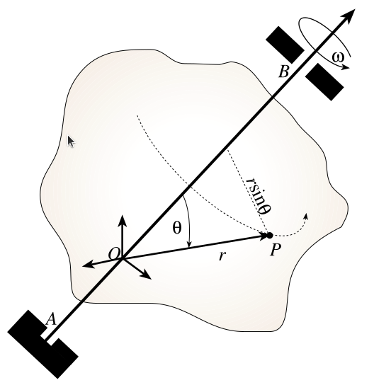

# 3. Производная вектора

Рассмотрим дифференцирование вектора и хорошо известную из теоретической механики **формулу Бура** (**transport theorem** в англоязычной литературе). 

## 3.1. Формула Бура

Рассмотрим вектор $\overline{r}$ и две системы координат: неподвижная $\text{I}$ и подвижная $\text{B}$. Система $\text{B}$ вращается относительно $\text{I}$ с угловой скоростью $\overline{\omega}_{\text{B}/\text{I}}$. Тогда производная вектора $\overline{r}$ в неподвижной системе координат равна сумме производной в подвижной системе координат (локальной производной) и векторного произведения угловой скорости вращения на сам вектор:

$$
\left(\dfrac{d\overline{r}}{dt}\right)^{\text{I}} = \left(\dfrac{d\overline{r}}{dt}\right)^{\text{B}} + \overline{\omega}_{\text{B}/\text{I}} \times \overline{r}.
$$

Эту формулу можно интерпретировать по-другому. Вектор характеризуется длиной и направлением. Следовательно, его производная должна состоять из двух компонентов: изменения длины и изменения направления. В приведенной формуле:

- первое слагаемое отвечает за скорость изменения длины вектора,
- второе слагаемое описывает скорость изменения его направления из-за вращения системы координат.

*Задание для самопроверки:* убедитесь, что верно равенство: $\left(\dfrac{\overline{\omega}_{\text{B}/\text{I}}}{dt}\right)^{\text{I}} = \left(\dfrac{\overline{\omega}_{\text{B}/\text{I}}}{dt}\right)^{\text{B}}$.

## 3.2. Вывод формулы Бура

Теперь подробно выведем ранее записанную формулу.

### 3.2.1. Частный случай: вращение вокруг неподвижной оси  

Предположим, что твердое тело вращается вокруг фиксированной оси $\text{AB}$ с угловой скоростью $\omega$. Пусть точка $\text{P}$ тела имеет радиус-вектор $\overline{r}$, а начало связанной с телом системы координат лежит в точке $\text{О}$.

Так как точка $\text{P}$ движется по окружности, ее скорость направлена по касательной и равна:

$$
|\dot{\overline{r}}| = (r\sin\theta)\omega.
$$

Чтобы записать это в векторной форме, умножим на единичный вектор направления скорости. Так как модуль векторного произведения $\overline{\omega} \times \overline{r}$ по определению равен $\omega r \sin\theta$, получаем:

$$
\dot{\overline{r}} = (r\sin\theta)\omega \underbrace{\frac{\overline{\omega} \times \overline{r}}{|\overline{\omega} \times \overline{r}|}}_{Направление} = \overline{\omega} \times \overline{r}.
$$

Это **формула Пуассона**, которая указывает на то, что производная радиус-вектора точки, закрепленной на вращающемся теле, определяется векторным произведением угловой скорости и самого вектора.

### 3.2.2. Общий случай вращения

Рассмотрим теперь произвольное вращательное движение связанной системы координат (ССК) $\text{B}$ относительно неподвижной системы координат $\text{I}$.

Пусть вектор $\overline{r}$ выражается через базисные орты $\overline{b}_1, \overline{b}_2, \overline{b}_3$ в следующем виде:

$$
\overline{r} = r_{1} \overline{b}_{1} + r_{2} \overline{b}_{2} + r_{3} \overline{b}_{3}.
$$

Возьмем его производную в подвижной системе координат, учитывая, что сами орты $\overline{b}_1, \overline{b}_2, \overline{b}_3$ неподвижны в собственной системе координат $\text{B}$:

$$
\left(\dfrac{d\overline{r}}{dt}\right)^{\text{B}} =
\dot{r}_1 \overline{b}_1 + \dot{r}_2 \overline{b}_2 + \dot{r}_3\overline{b}_3 + \underbrace{r_{1} \left(\dfrac{d\overline{b}_1}{dt}\right)^{\text{B}} + r_{2} \left(\dfrac{d\overline{b}_2}{dt}\right)^{\text{B}} + r_{3} \left(\dfrac{d\overline{b}_3}{dt}\right)^{\text{B}}}_{= 0}=\dot{r}_1 \overline{b}_1 + \dot{r}_2 \overline{b}_2 + \dot{r}_3\overline{b}_3.
$$

В уравнении выше $r_1$, $r_2$ и $r_3$ - скалярные величины, поэтому их дифференцирование не зависит от системы координат.

Теперь рассмотрим производную вектора $\overline{r}$ в неподвижной системе:

$$
\left(\dfrac{d\overline{r}}{dt}\right)^{\text{I}} =
\underbrace{\dot{r}_1 \overline{b}_1 + \dot{r}_2 \overline{b}_2 + \dot{r}_3\overline{b}_3}_{\left(\frac{d\overline{r}}{dt}\right)^{\text{B}}} + r_{1} \left(\dfrac{d\overline{b}_1}{dt}\right)^{\text{I}} + r_{2} \left(\dfrac{d\overline{b}_2}{dt}\right)^{\text{I}} + r_{3} \left(\dfrac{d\overline{b}_3}{dt}\right)^{\text{I}}.
$$

Учитывая формулу Пуассона $\left(\dfrac{d\overline{b}_i}{dt}\right)^{\text{I}} = \overline{\omega}_{\text{B}/\text{I}} \times \overline{b}_{i}\Big|_{i=1,2,3}$, получаем:

$$
\left(\dfrac{d\overline{r}}{dt}\right)^{\text{I}} = \left(\dfrac{d\overline{r}}{dt}\right)^{\text{B}} + \overline{\omega}_{\text{B}/\text{I}} \times (r_1\overline{b}_{1} + r_2\overline{b}_{2} + r_3\overline{b}_{3}) = \left(\dfrac{d\overline{r}}{dt}\right)^{\text{B}} + \overline{\omega}_{\text{B}/\text{I}} \times \overline{r}.
$$

**Итог:** мы получили формулу Бура, которая позволяет выразить производную вектора в неподвижной системе через его локальную производную и вращение системы координат.
Данная формула имеет широкий спектр применения. И позволяет вычислять скорости и ускорения в сложных движениях, например, при анализе гироскопов, механики роботов, космических аппаратов, робототехнических систем и других технических приложениях.
