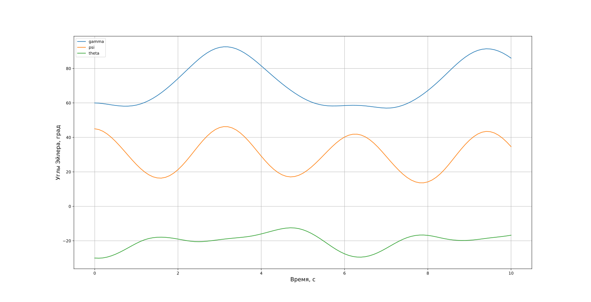

# 6. Углы Эйлера

**Углы Эйлера** - это последовательность поворотов вокруг заданных осей системы координат. Для космических аппаратов ориентация объекта часто описывается углами **крена** $\gamma$, **рыскания** $\psi$ и **тангажа** $\vartheta$. Будем предполагать, что:

- вращение по **крену** на угол $\gamma$ осуществляется вокруг оси с индексом 1, например, $\overline{b}_1$,
- по **рысканию** на угол $\psi$ - вокруг оси с индексом 2,
- по **тангажу** на угол $\vartheta$ - вокруг оси с индексом 3.


## 6.1. Последовательности поворотов

Любые последовательные повороты можно назвать углами Эйлера, названия углов могут отличаться в зависимости от области применения.

Например, чтобы задать ориентацию орбитальной плоскости в **ИСК**, выполняются три последовательных поворота:

1. Вокруг оси $\overline{i}_3$ на долготу восходящего узла $\Omega$,
2. Вокруг промежуточной оси $\overline{b}_1'$ на угол наклонения орбиты $i$,
3. Вокруг оси $\overline{b}_3$ на аргумент перицентра $\omega$.

Видно, что все повороты выполняются относительно осей разных системам координат.


## 6.2. Свойства углов Эйлера

Углы Эйлера широко используются для описания ориентации космических аппаратов в пространстве. Рассмотрим их основные свойства:

1) **Последовательность поворотов имеет значение**. Мы будем обозначать ее, например, как $1 \rightarrow 2 \rightarrow 3$ или $\gamma \rightarrow \psi \rightarrow \vartheta$, что означает, что сначала выполняется поворот вокруг оси 1 на угол $\gamma$, затем вокруг оси 2 на $\psi$, и в конце - вокруг оси 3 на $\vartheta$. Например, следующие разные комбинации поворотов описывают одинаковую ориентацию объекта в пространстве:

$$
\begin{matrix}
\vartheta = 60^{\circ} \rightarrow \psi = 50^{\circ} \rightarrow \gamma=70^{\circ} \\
\vartheta = 75.6^{\circ} \rightarrow \gamma = 77.3^{\circ} \rightarrow \vartheta=-51.7^{\circ} \\
\gamma = 37.2^{\circ} \rightarrow \vartheta = -3.7^{\circ} \rightarrow \psi=71.2^{\circ}
\end{matrix}
$$
   
2) **Существует 12 различных последовательностей поворотов**. Первый поворот возможен вокруг 3 осей, второй - вокруг двух оставшихся, третий - снова вокруг двух возможных осей, не совпадающих с осью второго поворота:  
   
$$
3 \times 2 \times 2 = 12.
$$
   
3) **Симметричные и несимметричные последовательности**. Если первый и третий повороты выполняются вокруг оси с одинаковым индексом, последовательность называется **симметричной**. Всего существует 6 таких последовательностей.

4) **Вырожденные случаи**. Для описания произвольного углового положения требуется три угла. Это значит, что при определенных пространственных положениях мы будем получать неопределенность. 
 
   Проблемным углом всегда является второй. В **симметричных** последовательностях вырождение наступает при втором угле, равном $0^\circ$ или $180^\circ$. В **несимметричных** последовательностях - при $\pm90^\circ$. 
   
   Для симметричных поворотов такой результат является интуитивным, т.к. при нулевом втором угле первый и третий повороты совершаются вокруг одной оси, т.е. просто суммируются и перестают быть различимыми.

5) **Наглядность для малых углов**. Небольшие углы позволяют интуитивно понять ориентацию объекта, но большие значения углов могут сбивать с толку, т.к. их комбинация может приводить к ориентации, близкой к исходной.

6) **Линеаризация кинематических уравнений**. Для малых углов уравнения кинематики хорошо линеаризуются, что упрощает анализ и позволяет выводить аналитические решения для некоторых задач.

## 6.3. Связь МНК с углами Эйлера

Каждому отдельному повороту соответствует своя матрица направляющих косинусов.

В качестве примера рассмотрим поворот по тангажу.


На рисунке выше **ССК** поворачивается относительно **ИСК** на угол $\vartheta$ вокруг оси $\overline{i}_3$. Выразим взаимосвязь между **ортами** двух систем координат:

$$
\begin{cases}
\overline{b}_1 = \overline{i}_1 \cos{\vartheta} + \overline{i}_2 \sin{\vartheta}, \\
\overline{b}_2 = -\overline{i}_1 \sin{\vartheta} + \overline{i}_2 \cos{\vartheta}, \\
\overline{b}_3 = \overline{i}_3.
\end{cases}
$$

Или:

$$
\begin{pmatrix}
	\overline{b}_1 \\ \overline{b}_2 \\ \overline{b}_3
\end{pmatrix} = 
\begin{pmatrix}
	\cos{\vartheta} & \sin{\vartheta} & 0 \\
	-\sin{\vartheta} & \cos{\vartheta} & 0 \\ 
	0 & 0 & 1
\end{pmatrix} \cdot
\begin{pmatrix}
	\overline{i}_1 \\ \overline{i}_2 \\ \overline{i}_3
\end{pmatrix} = 
\textbf{C}(\vartheta) \cdot
\begin{pmatrix}
	\overline{i}_1 \\ \overline{i}_2 \\ \overline{i}_3
\end{pmatrix} .
$$

В данном случае матрица $\textbf{C}(\vartheta)$ описывает поворот по тангажу. Аналогично можно выразить матрицы поворота для углов крена и рыскания. 

Все три матрицы будут иметь следующий вид:

|                                               $\textbf{C}(\gamma)$                                                |                                            $\textbf{C}(\psi)$                                            |                                                   $\textbf{C}(\vartheta)$                                                    |
| :---------------------------------------------------------------------------------------------------------------: | :------------------------------------------------------------------------------------------------------: | :--------------------------------------------------------------------------------------------------------------------------: |
| $$\begin{pmatrix}1 & 0 & 0 \\ 0 & \cos{\gamma} & \sin{\gamma} \\ 0 & -\sin{\gamma} & \cos{\gamma} \end{pmatrix}$$ | $$\begin{pmatrix}\cos{\psi} & 0 & -\sin{\psi} \\ 0 & 1 & 0 \\ \sin{\psi} & 0 & \cos{\psi}\end{pmatrix}$$ | $$\begin{pmatrix}\cos{\vartheta} & \sin{\vartheta} & 0 \\ -\sin{\vartheta} & \cos{\vartheta} & 0 \\ 0 & 0 & 1\end{pmatrix}$$ |

Теперь рассмотрим в качестве примера пространственный поворот $\psi \rightarrow \vartheta \rightarrow \gamma$. Соответствующая ему **МНК** определяется как произведение:

$$
\textbf{C}(\psi \rightarrow \vartheta \rightarrow \gamma) = \textbf{C}(\gamma) \cdot \textbf{C}(\vartheta) \cdot \textbf{C}(\psi).
$$

И имеет следующий вид:

$$
\textbf{C}(\psi \rightarrow \vartheta \rightarrow \gamma) = 
\begin{pmatrix}

	\cos{\vartheta} \cos{\psi} & 
	\sin{\vartheta} & 
	-\cos{\vartheta} \sin{\psi} \\
	
	-\cos{\gamma} \cos{\psi} \sin{\vartheta} + \sin{\gamma} \sin{\vartheta} & 
	\cos{\gamma} \cos{\vartheta} &
	\cos{\gamma} \sin{\psi} \sin{\vartheta} + \sin{\gamma} \cos{\psi} \\
	
	\sin{\gamma} \cos{\psi} \sin{\vartheta} + \cos{\gamma} \sin{\psi} &
	-\sin{\gamma} \cos{\vartheta} &
	-\sin{\gamma} \sin{\psi} \sin{\vartheta} + \cos{\gamma} \cos{\psi}
\end{pmatrix}.
$$

Пример расчета матрицы направляющих косинусов по известным углам Эйлера на языке **Python**:

```python
import numpy as np  
  
# Задание углов в радианах.  
gamma = np.radians(60)  
psi = np.radians(45)  
theta = np.radians(-30)  
  
# Матрица поворота по крену.  
C_gamma = np.array(  
    [[1, 0, 0], [0, np.cos(gamma), np.sin(gamma)], [0, -np.sin(gamma), np.cos(gamma)]]  
)  
# Матрица поворота по рысканию.  
C_psi = np.array(  
    [[np.cos(psi), 0, -np.sin(psi)], [0, 1, 0], [np.sin(psi), 0, np.cos(psi)]]  
)  
# Матрица поворота по тангажу.  
C_theta = np.array(  
    [[np.cos(theta), np.sin(theta), 0], [-np.sin(theta), np.cos(theta), 0], [0, 0, 1]]  
)  
  
# Матрица для последовательности psi->theta->gamma.  
C = C_gamma @ C_theta @ C_psi  
print(C)
```

## 6.4. Связь углов Эйлера с МНК

Если известна матрица направляющих косинусов $\textbf{C}$, то можно найти соответствующие ей углы Эйлера. Например, для последовательности $\psi \rightarrow \vartheta \rightarrow \gamma$ углы вычисляются следующим образом (это легко вывести из вида матрицы):

$$
\begin{cases}
\gamma = \textrm{arctg}\left(-{\dfrac{\textbf{C}_{32}}{\textbf{C}_{22}}} \right), \\
\psi = \textrm{arctg}\left(-{\dfrac{\textbf{C}_{13}}{\textbf{C}_{11}}}\right), \\
\vartheta = \arcsin{\textbf{C}_{12}}. \\
\end{cases}\tag{6.1}
$$

При программировании вместо арктангенса правильнее использовать функцию $\text{atan2}$, реализованную во многих языках программирования. Она позволяет точно определить четверть угла, тогда как обычный арктангенс ограничен 1 и 4 четвертями. Например, для угла рыскания это будет выглядеть так:

$$
\psi = -\textrm{atan2}(-\textbf{C}_{13}, \textbf{C}_{11})
$$

>Проблемный второй угол всегда можно выразить, используя один элемент матрицы поворота, в то время как 2 других угла зависят уже от 2 элементов матрицы.

## 6.5. Сложение поворотов

Предположим, что космический аппарат сначала совершил поворот в пространстве на углы $\phi_1 \rightarrow \phi_2 \rightarrow \phi_3$ (сейчас не принципиально какие именно углы), а затем совершил поворот на углы $\theta_1 \rightarrow \theta_2 \rightarrow \theta_3$. Нам необходимо найти углы Эйлера, задающие финальную ориентацию спутника.

Напрямую углы Эйлера складывать нельзя. В приближении, конечно, можно это сделать для маленьких углов, но все равно это будет аппроксимацией реальной ориентации.
Сложение осуществляется через перемножение **МНК**:
$$
\textbf{C}^* = \textbf{C}(\theta_1 \rightarrow \theta_2 \rightarrow \theta_3) \cdot \textbf{C}(\phi_1 \rightarrow \phi_2 \rightarrow \phi_3),
$$
где $\textbf{C}^*$ - **МНК** итогового поворота.
А затем уже извлечь новые углы Эйлера из полученной матрицы.

## 6.6. Сложение поворотов для симметричных последовательностей

Для симметричных поворотов углы можно складывать практически напрямую, не прибегая к **МНК**. Здесь мы приведем соответствующие формулы исключительно для ознакомления, поскольку их вывод основан на сферической тригонометрии, выходящей за рамки курса. При этом важно, чтобы первый и второй повороты выполнялись в одной и той же последовательности - полученные углы будут справедливы только для нее. Если итоговый поворот задается последовательностью $\varphi_1 \rightarrow \varphi_2 \rightarrow \varphi_3$, то:

$$
\begin{cases}
\varphi_2 = \arccos(\cos{\theta_2} \cos{\phi_2} - \sin{\theta_2} \sin{\phi_2} \cos{\theta_3 + \phi_1}), \\
\varphi_1 = \theta_1 + \arctan\left( \dfrac{\sin{\theta_2} \sin{\phi_2} \sin({\theta_3 + \phi_1})}{\cos{\phi_2} - \cos{\theta_2} \cos{\varphi_2}} \right), \\
\varphi_3 = \phi_3 + \arctan\left( \dfrac{\sin{\theta_2} \sin{\phi_2} \sin({\theta_3 + \phi_1})}{\cos{\theta_2} - \cos{\phi_2} \cos{\varphi_2}} \right).
\end{cases}
$$

## 6.7. Уравнения кинематики

Количество уравнений кинематики для **углов Эйлера** соответствует числу возможных комбинаций их последовательности, то есть 12. В качестве примера рассмотрим вывод уравнений для последовательности поворотов $\psi \rightarrow \vartheta \rightarrow \gamma$ (см. рисунок ниже). 


Угловая скорость вращения **ССК** в этом случае выражается как:

$$
\overline{\omega}^\textrm{B}_{\text{B}/\text{I}} = \dot{\gamma} \overline{b}_1 + \dot{\vartheta}\overline{b}_3' + \dot{\psi}\overline{i}_2.
$$

Однако нам требуется представить ее в базисе $(\overline{b}_1, \overline{b}_2, \overline{b}_3)$. Сначала выразим векторы $\overline{b}_3'$ и $\overline{i}_2$ через этот базис. Из поворота (3) видно, что

$$
\overline{b}_3' = \overline{b}_3 \cos{\gamma} + \overline{b}_2 \sin{\gamma}.
$$

Для $\overline{i}_2$ воспользуемся матрицей поворота $\textbf{C}(\psi \rightarrow \vartheta \rightarrow \gamma)$, второй столбец которой задает его координаты в **ССК**:

$$
\overline{i}_2 = \overline{b}_1 \sin{\vartheta} + \overline{b}_2 \cos{\gamma} \cos{\vartheta} - \overline{b}_3 \sin{\gamma} \cos{\vartheta}.
$$

Подставляя эти выражения в формулу угловой скорости, получаем:

$$
\overline{\omega}^\mathrm{B}_{\text{B}/\text{I}} = 
\begin{pmatrix} 
1 & \sin{\vartheta} & 0 \\
0 & \cos{\gamma}\cos{\vartheta} & \sin{\gamma} \\
0 & -\sin{\gamma}\cos{\vartheta} & \cos{\gamma}
\end{pmatrix}
\begin{pmatrix}
\dot{\gamma} \\ \dot{\psi} \\ {\dot{\vartheta}}
\end{pmatrix}.
$$

На практике более полезно выражать производные углов через угловую скорость, так как последняя часто является измеряемой величиной:

$$
\begin{pmatrix}
	\dot{\gamma} \\ \dot{\psi} \\ {\dot{\vartheta}}
\end{pmatrix} = 
\frac{1}{\cos{\vartheta}}
\begin{pmatrix} 
	\cos{\vartheta} & -\sin{\vartheta} \cos{\gamma} & \sin{\gamma} \ \sin{\vartheta} \\
	0 & \cos{\gamma} & -\sin{\gamma} \\
	0 & -\sin{\gamma}\cos{\vartheta} & \cos{\gamma} \cos{\vartheta}
\end{pmatrix}

\ \overline{\omega}^\mathrm{B}_{\text{B}/\text{I}}.
$$

Обратите внимание, что в этой формуле присутствует деление на $\cos{\vartheta}$, что приводит к вырождению при $\vartheta = \pm 90^\circ$. Для симметричных последовательностей поворотов аналогичное уравнение будет содержать деление на синус соответствующего угла.

Пример численного решения уравнений кинематики на языке **Python**:

```python
import matplotlib.pyplot as plt  
import numpy as np  
from scipy.integrate import solve_ivp  
  
  
def gyroscope_sensor(t: float) -> np.ndarray:  
    """Имитация измерений датчика угловых скоростей."""  
    omega = np.array([0.3 * np.sin(t), -0.05 * np.cos(t), np.sin(t) * np.cos(t)])  
    return omega  
  
  
def euler_kinematic_right_hand_side(t: float, y: np.ndarray) -> np.ndarray:  
    """Правые части системы ОДУ, задающих кинематические уравнения."""  
    # Угловые скорости с датчика.  
    omega = gyroscope_sensor(t)  
    # Правые части кинематических уравнений.  
    gamma, psi, theta = y  
    rhs = np.array(  
        [  
            [np.cos(theta), -np.cos(gamma) * np.sin(theta), np.sin(gamma) * np.sin(theta)],  
            [0, np.cos(gamma), -np.sin(gamma)],  
            [0, np.sin(gamma) * np.cos(theta), np.cos(gamma) * np.cos(theta)],  
        ]  
    )  
    rhs /= np.cos(theta)  
    rhs = rhs @ omega  
    return rhs  
  
  
# Начальная ориентация.  
gamma = np.radians(60)  
psi = np.radians(45)  
theta = np.radians(-30)  
  
sol = solve_ivp(  
    euler_kinematic_right_hand_side,  
    t_span=[0, 10],  
    y0=[gamma, psi, theta],  
    t_eval=np.arange(0, 10.1, 0.1),  
)  
  
# Время, с.  
time = sol.t  
gamma, psi, theta = sol.y[0, :], sol.y[1, :], sol.y[2, :]  
# Трюк, чтобы все углы были в диапазоне от -180 до +180 градусов.  
gamma = np.degrees(np.atan2(np.sin(gamma), np.cos(gamma)))  
psi = np.degrees(np.atan2(np.sin(psi), np.cos(psi)))  
theta = np.degrees(np.atan2(np.sin(theta), np.cos(theta)))  
  
plt.figure(figsize=(15, 5))  
plt.plot(time, gamma, label="gamma")  
plt.plot(time, psi, label="psi")  
plt.plot(time, theta, label="theta")  
plt.xlabel("Время, с")  
plt.ylabel("Угол Эйлера, град")  
plt.legend()  
plt.grid()  
plt.show()
```

Результаты моделирования:



## 6.8. Заключение

Углы Эйлера представляют собой простой и удобный способ описания ориентации. Перечислим основные преимущества и недостатки данного метода.

**Преимущества**

* Обладают наглядностью и простотой интерпретации для малых углов.
* Позволяют линеаризовать кинематические уравнения для малых углов, упрощая решение задач управления ориентацией.
* Совместимы с показаниями многих датчиков ориентации (например, Земли или Солнца), которые непосредственно выдают данные в этой форме.
* Требуют всего трех параметров для полного описания ориентации, что делает их более компактными по сравнению с другими методами.
* В отличие от **МНК**, где при численном интегрировании могут накапливаться ошибки и приводить к потере ортогональности матрицы, в углах Эйлера таких проблем не возникает, что повышает надежность в прикладных задачах.

**Недостатки**

- Имеют проблему вырождения: для несимметричных последовательностей поворотов - при значениях второго угла ±90°, а для симметричных - при 0° и 180°.
- Не поддерживают операцию прямого сложения поворотов, что усложняет расчет последовательных вращений.
- Разные последовательности поворотов могут давать одинаковый конечный результат, что создает неоднозначность в интерпретации.
- Сложность интерпретации для больших значений углов.
