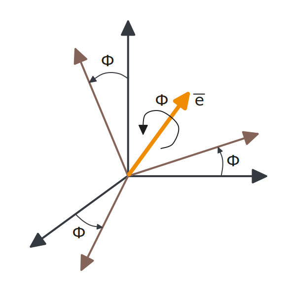
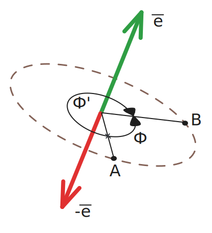
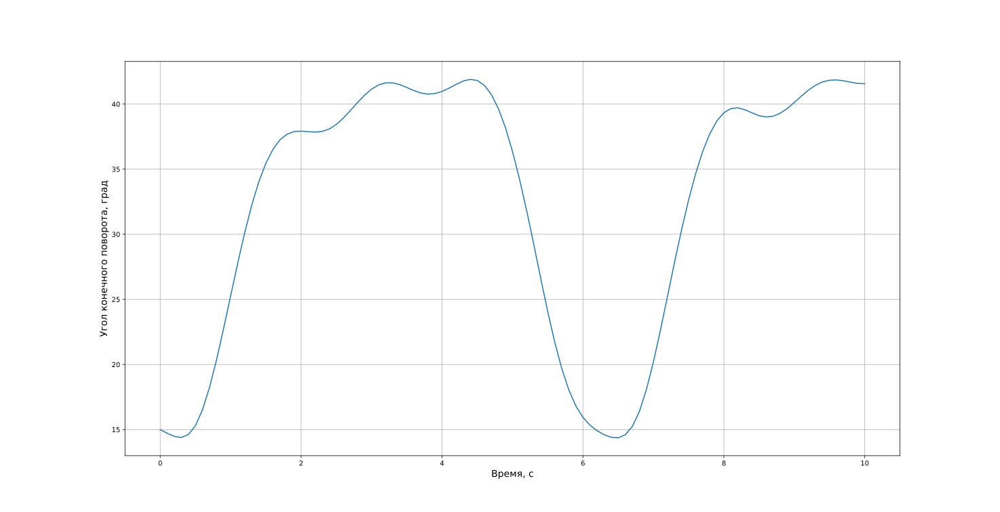

# 7. Вектор конечного поворота

В предыдущих главах мы рассмотрели:

* **матрицу направляющих косинусов (МНК)** - универсальный, но избыточный метод описания ориентации,
* **углы Эйлера** - интуитивно понятный, но подверженный вырождению подход.

Теперь обратимся к **методу конечного поворота**, который является теоретической основой для построения более продвинутых методов описания ориентации, таких как **кватернионы** или **параметры Родрига**.

## 7.1. Теорема Эйлера

Метод конечного поворота основан на **теореме вращения Эйлера**, которая утверждает, что 

>*Любое движение твердого тела в трехмерном пространстве, имеющее неподвижную точку, является вращением тела вокруг некоторой оси. Таким образом, вращение может быть описано тремя тремя координатами оси вращения и одним углом поворота.*

Т.е. ориентацию можно однозначно задать всего четырьмя параметрами: вектором оси вращения $\overline{e}$ и углом поворота вокруг этой оси $\Phi$.



Например, последовательность поворотов $\vartheta=60^{\circ} \rightarrow \psi=50^{\circ} \rightarrow \gamma=90^{\circ}$ эквивалентна одному повороту на угол $\Phi=80.34^{\circ}$ вокруг вектора $\overline{e}=\begin{pmatrix}0.430, & 0.868, & 0.250\end{pmatrix}^{T}$. 

Для однозначности описания вводится естественное ограничение: вектор оси вращения $\overline{e}$ всегда считается единичным. Это позволяет избежать избыточности в параметризации, оставляя три независимых параметра (два для задания направления оси и один для угла поворота).

Математически вектор конечного поворота записывается следующим образом: 

$$\overline{\phi} = \Phi\overline{e},$$

т.е. длина вектора $\overline{\phi}$ равна $\Phi$, а направление совпадает с $\overline{e}$.

## 7.2. Свойства вектор конечного поворота

1) **Наглядность интерпретации.**
 
   Зная угол $\Phi$ и ось вращения $\overline{e}$, можно сразу представить пространственную ориентацию объекта. Например, поворот на $80^{\circ}$ вокруг конкретной оси дает более ясное представление об угловом положении, чем три отдельных угла Эйлера, особенно при больших значениях.

2) **Вырождение.**

   При нулевом угле поворота возникает неопределенность - любая ось в этом случае формально подходит для описания положения. Эта особенность требуют особого внимания при численной реализации алгоритмов. Далее мы увидим, что неопределенность возникает и при $\Phi=180^{\circ}$.
 
3) **Неоднозначность описания ориентации.**

   Интересная особенность метода проявляется в том, что одну и ту же конечную ориентацию можно описать четырьмя различными комбинациями параметров. Например, короткий поворот на угол $\Phi$ вокруг оси $\overline{e}$ эквивалентен:
   
   * длинному повороту на угол $\Phi'=\Phi - 2\pi$ вокруг оси $\overline{e}$,
   * короткому повороту угол $-\Phi$ вокруг оси $-\overline{e}$,
   * длинному повороту на угол $-\Phi'$ вокруг оси $-\overline{e}$.

   Эта многозначность, показанная на рисунке, не влияет на физический смысл, но важна при численных расчетах, так как требует дополнительной проверки выбора оптимального представления.



## 7.3. Связь вектора конечного поворота с МНК

Следствие теоремы Эйлера проявляется в том, что ось вращения $\overline{e}$ сохраняет свои координаты как в исходной $\text{I}$, так и в повернутой $\text{B}$ системе координат. Это ключевое свойство математически выражается через матричное уравнение:

$$
\overline{e}^{\mathrm{B}} = \textbf{C}_{\mathrm{I} \rightarrow \mathrm{B}} \ \overline{e}^{\mathrm{I}},
$$

или в общем виде, опустив индексы:

$$
\overline{e} = \textbf{C} \ \overline{e}.
$$

Т.е. мы умножаем вектор на матрицу и получаем тот же самый вектор. Это значит, что вектор поворота $\overline{e}$ является **собственным вектором** матрицы $\textbf{C}$, задающей ориентацию $\text{B}$ относительно $\text{I}$.

Не вдаваясь в теорию собственных векторов, отметим ключевые для нашего случая свойства: любая матрица поворота $3 \times 3$ обладает тремя собственными значениями, одно из которых всегда равно единице (для **МНК**), а два других образуют комплексно-сопряженную пару. Это фундаментальное свойство гарантирует, что вектор конечного поворота, соответствующий единичному собственному значению, всегда существует и однозначно (с точностью до направления) определяет ось вращения.

Пример программы на **Python** для поиска вектора конечного поворота по заданной **МНК** через собственные вектора:

```python
import numpy as np

# Матрица направляющих косинусов.  
C = np.array(  
    [  
        [0.6123724356957946, 0.7071067811865476, -0.35355339059327373],  
        [0.1268264840443219, 0.35355339059327384, 0.9267766952966369],  
        [0.7803300858899107, -0.6123724356957946, 0.1268264840443222]  
    ]  
)  
  
# Собственные числа и собственные вектора.  
eigenvalues, eigenvector = np.linalg.eig(C)  
# Избавимся от мнимой части, т.к. для нашей задачи она роли не играет.  
eigenvalues = np.real(eigenvalues)  
eigenvector = np.real(eigenvector)  
  
# Порядок собственных чисел не гарантируется.  
# Найдем индекс, соответствующий единичному собственному значению.  
# Т.к. возможны погрешности численных расчетов, то знак строго равенства заменим на нестрогое.  
index = np.where(np.isclose(eigenvalues, 1))[0] 
  
# Вектора записываются по столбцам, поэтому index - номер столбца. 
# flatten используем для удобства, чтобы полученный вектор был одномерным.
rotation_vector = eigenvector[:, index].flatten()  
  
print(rotation_vector)
```

На практике обычно переход от матрицы направляющих косинусов $\textbf{C}$ к параметрам конечного поворота осуществляется через следующие соотношения:

$$
\cos{\Phi} = \frac{1}{2}(C_{11} + C_{22} + C_{33} - 1),\tag{7.1}
$$

$$
\overline{e} = \frac{1}{2 \sin{\Phi}} \begin{pmatrix}C_{23} - C_{32} \\ C_{31} - C_{13} \\ C_{12} - C_{21}\end{pmatrix}.\tag{7.2} 
$$

Формула (7.1) определяет косинус угла конечного поворота. Поэтому $\Phi \in [0, \pi]$ по свойству арккосинуса, т.е. мы сразу получаем угол, описывающий короткий поворот. 

Обратите внимание, что в формуле (7.2) в знаменателе стоит $\sin{\Phi}$, который обращается в ноль при $\Phi=0^{\circ}$ или $\Phi=180^{\circ}$.

## 7.4. Связь МНК с вектором конечного поворота

Зная параметры конечного поворота $(\Phi, \overline{e})$, можно вычислить соответствующую матрицу направляющих косинусов:

$$
\textbf{C} = 
\begin{pmatrix}
e_{1}^{2} \lambda + \cos{\Phi} & e_1e_2\lambda + e_3\sin{\Phi} & e_1e_3\lambda - e_2\sin{\Phi} \\
e_1e_2\lambda - e_3\sin{\Phi} & e_{2}^{2} \lambda + \cos{\Phi} & e_2e_3\lambda + e_1\sin{\Phi} \\
e_1e_3\lambda + e_2\sin{\Phi} & e_2e_3\lambda - e_1\sin{\Phi} & e_{3}^{2} \lambda + \cos{\Phi}
\end{pmatrix},
$$

где $\lambda=1-\cos{\Phi}$.

## 7.5. Сложение поворотов

При последовательном выполнении двух поворотов $(\Phi_1, \overline{e}_1)$ и $(\Phi_2, \overline{e}_2)$, их можно заменить одним эквивалентным поворотом $(\Phi, \overline{e})$. Существует два основных подхода к решению этой задачи:

1) Через перемножение соответствующих **МНК**: 

$$
\textbf{C}(\Phi, \overline{e}) = \textbf{C}(\Phi_2, \overline{e}_2) \ \textbf{C}(\Phi_1, \overline{e}_1).
$$

2) Непосредственное вычисление параметров результирующего поворота по нижеприведенным формулам:

$$
\Phi = 
2\arccos(
	\cos{\frac{\Phi_{1}}{2}} \cos{\frac{\Phi_{2}}{2}} - 
	\sin{\frac{\Phi_{1}}{2}} \sin{\frac{\Phi_{2}}{2}} \overline{e}_1 \cdot \overline{e}_2
),
$$

$$
\overline{e} = 
\dfrac{
	\sin{\frac{\Phi_1}{2}} \cos{\frac{\Phi_2}{2}} \overline{e}_1 + 
	\cos{\frac{\Phi_1}{2}} \sin{\frac{\Phi_2}{2}} \overline{e}_2 + 
	\sin{\frac{\Phi_1}{2}} \sin{\frac{\Phi_2}{2}} \overline{e}_1 \times \overline{e}_2
} 
{ \sin{\frac{\Phi}{2}} }.
$$

   Здесь $\overline{e}_1 \cdot \overline{e}_2$ - скалярное произведение, $\overline{e}_1 \times \overline{e}_2$ - векторное произведение.

При использовании второго метода необходимо быть внимательным при нахождении вектора конечного поворота $\overline{e}$, т.к. может произойти деление на ноль. Например, если мы сначала повернулись в одном направлении на $90^{\circ}$, а затем в противоположном направлении на $-90^{\circ}$ (вернулись в исходное положение), то итоговый угол поворота будет равен нулю, что приведет к делению на ноль.

## 7.6. Уравнения кинематики

Динамика изменения вектора конечного поворота описывается нелинейным дифференциальным уравнением, связывающим производную параметров поворота с мгновенной угловой скоростью:

$$
\dot{\overline{\phi}} = 
\left[\
	\ \textbf{I}_{3 \times 3}\  +
	\frac{1}{2} [\tilde{\phi}] + \frac{1}{\Phi^{2}} \left(1 - \frac{\Phi}{2} \text{ctg}{\left(\frac{\Phi}{2}\right)} \right) \ [\tilde{\phi}]^{2}
\ \right] \ \overline{\omega}^{\text{B}}_{\text{B}/\text{I}}.
$$

В этом уравнении:

* $\textbf{I}_{3 \times 3}=\begin{pmatrix}1 & 0 & 0\\ 0 & 1 & 0 \\ 0 & 0 & 1\end{pmatrix}$ - единичная матрица размерности 3,
* $[\tilde{\phi}] = \begin{pmatrix} 0 & -\phi_{3} & \phi_{2} \\ \phi_{3} & 0 & -\phi_{1} \\ -\phi_{2} & \phi_{1} & 0\end{pmatrix}$ - кососимметричная матрица вектора $\overline{\phi}$,
* $\Phi$ - угол конечного поворота,
* $\overline{\omega}^{\text{B}}_{\text{B}/\text{I}}$ - вектор угловой скорости вращения космического аппарата относительно **ИСК**.

Пример численного решения уравнений кинематики на языке **Python**:

```python
import matplotlib.pyplot as plt  
import numpy as np  
from scipy.integrate import solve_ivp  
  
  
def gyroscope_sensor(t: float) -> np.ndarray:  
    """Имитация измерений датчика угловых скоростей."""  
    omega = np.array([0.3 * np.sin(t), -0.05 * np.cos(t), np.sin(t) * np.cos(t)])  
    return omega  
  
  
def rpv_kinematic_right_hand_side(t: float, y: np.ndarray) -> np.ndarray:  
    """Правые части системы ОДУ, задающих кинематические уравнения."""  
    # Угловые скорости с датчика.  
    omega = gyroscope_sensor(t)  
    # Текущий угол поворота.  
    fi = np.linalg.norm(y)  
    # Кососимметрическая матрица вектора конечного поворота.  
    y_skew = np.array([[0, -y[2], y[1]], [y[2], 0, -y[0]], [-y[1], y[0], 0]])  
    # Правые части кинематических уравнений.  
    rhs = (  
            np.eye(3)  
            + 0.5 * y_skew  
            + 1 / fi ** 2 * (1 - 0.5 * fi * (1 / np.tan(fi / 2))) * y_skew ** 2  
    )  
    rhs = rhs @ omega  
    return rhs  
  
  
# Начальная ориентация.  
fi0 = np.radians(15)  # Угол поворота.  
e0 = np.array([0, 1, 0])  # Вектор поворота.  
y0 = fi0 * e0  # Вектор конечного поворота.  
  
sol = solve_ivp(  
    rpv_kinematic_right_hand_side,  
    t_span=[0, 10],  
    y0=y0,  
    t_eval=np.arange(0, 10.1, 0.1),  
)  
# Время, с.  
time = sol.t  
# Угол конечного поворота, град.  
# Заметим, что угол поворота равен норме вектора конечного поворота,  
# поэтому используется конструкция np.linalg.norm.  
fi = np.degrees(np.linalg.norm(sol.y, axis=0))  
  
plt.figure(figsize=(15, 5))  
plt.plot(time, fi)  
plt.xlabel("Время, с", fontsize=14)  
plt.ylabel("Угол конечного поворота, град", fontsize=14)  
plt.grid()  
plt.show()
```

Результаты моделирования:



## 7.7. Заключение

Метод конечного поворота, основанный на теореме Эйлера, предлагает принципиально иной подход к описанию ориентации объектов в пространстве. Его ключевое преимущество заключается в исключительной наглядности - в отличие от матрицы направляющих косинусов и углов Эйлера, он позволяет непосредственно воспринимать пространственное положение объекта через единый поворот вокруг определенной оси.

Однако практическое применение этого метода сталкивается с существенными ограничениями. Главная трудность возникает именно в наиболее важном с точки зрения управления случае - при малых углах отклонения от базовой ориентации, когда аппарат должен поддерживать нулевое положение. В этих условиях метод теряет свою эффективность из-за принципиальных особенностей математического аппарата.

Тем не менее, ценность этого подхода заключается в том, что он служит теоретической основой для более совершенных и практичных методов параметризации вращения, таких как кватернионы и параметры Родрига, с которыми мы познакомимся в последующих разделах. 
