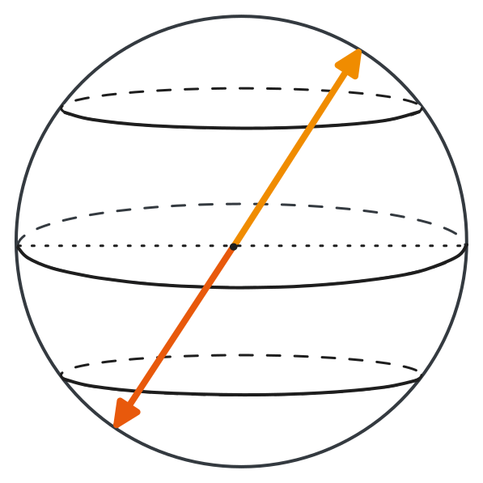
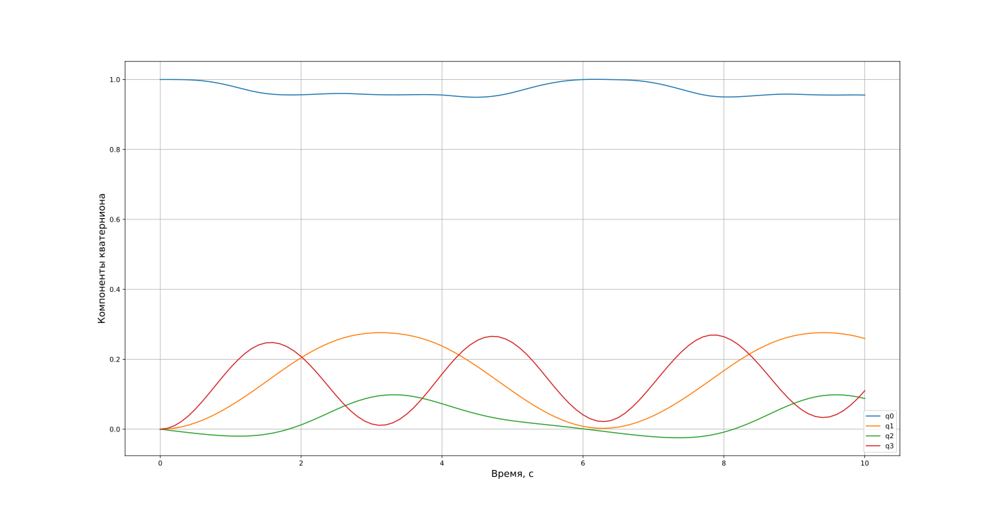

# 8. Кватернионы

**Кватернионы** представляют собой эффективный способ описания поворота твердого тела в трехмерном пространстве. Они задаются через параметры **конечного поворота** следующим образом:

$$
\begin{cases}
	q_0 = \cos{\dfrac{\Phi}{2}}, \\
	q_1 = \overline{e}_1 \sin{\dfrac{\Phi}{2}}, \\
	q_2 = \overline{e}_2 \sin{\dfrac{\Phi}{2}}, \\
	q_3 = \overline{e}_3 \sin{\dfrac{\Phi}{2}}, \\
\end{cases}
$$

где $\overline{e} = (\overline{e}_1, \overline{e}_2, \overline{e}_3)$ - единичный вектор, задающий ось вращения, а $\Phi$ - угол поворота.

Компонент $q_0$ называется **скалярной частью**, а компоненты $(q_1, q_2, q_3)$ образуют **векторную часть**. Для компактности записи будем обозначать кватернион как $\overline{q}$.

В технической литературе иногда используется обозначение $(q_1, q_2, q_3, q_4)$, где $q_4$ - скалярная часть. В дальнейшем изложении мы будем придерживаться первой нотации, где скалярная компонента обозначается как $q_0$.

С точки зрения геометрии, кватернион - это точка на единичной 4D-сфере. В таком представлении:

- скалярная часть отвечает за **величину поворота**,
- векторная часть - за **ось вращения**.

Кватернионы не подвержены вырождениям, характерным для углов Эйлера или вектора конечного поворота, и обеспечивают глобальную параметризацию пространства вращений.

## 8.1. Свойства кватернионов

1) **Отсутствие вырождений.**

   Ключевое преимущество кватернионов - отсутствие вырожденных случаев при любых углах поворота. В отличие от углов Эйлера или вектора конечного поворота, кватернионное представление корректно описывает все возможные ориентации, что делает его идеальным для моделирования сложных вращательных движений.

2) **Нормировка.**

   Все допустимые кватернионы удовлетворяют условию:

$$
q_0^2 + q_1^2 + q_2^2 + q_3^2 = 1.
$$

   Это условие математически отражает тот факт, что все допустимые ориентации соответствуют точкам на поверхности единичной 4D-сферы.
   
3) **Двойственность описания ориентации.**

   Одну и ту же ориентацию можно представить двумя противоположными кватернионами: $\overline{q}$ и $-\overline{q}$. Это связано с периодичностью тригонометрических функций:
   
   * короткий поворот: $\Phi$, скалярная часть положительна;
   * длинный поворот: $\Phi' = \Phi - 2 \pi$, скалярная часть отрицательна.

   Таблица ниже иллюстрирует это:

|      Параметры поворота     |                                        Соответствующий кватернион                                         |
| :-------------------------: | :-------------------------------------------------------------------------------------------------------: |
|  $$(\overline{e}, \Phi)$$   |   $$\begin{cases}q_0=\cos{\dfrac{\Phi}{2}}, \\ q_i = \overline{e}_i \sin{\dfrac{\Phi}{2}}.\end{cases}$$   |
| $$(-\overline{e}, -\Phi)$$  |  $$\begin{cases}q_0 = \cos{\dfrac{\Phi}{2}}, \\ q_i =\overline{e}_i \sin{\dfrac{\Phi}{2}}.\end{cases}$$   |
|  $$(\overline{e}, \Phi')$$  | $$\begin{cases}q_0 = -\cos{\dfrac{\Phi}{2}}, \\ q_i = -\overline{e}_i \sin{\dfrac{\Phi}{2}}.\end{cases}$$ |
| $$(-\overline{e}, -\Phi')$$ | $$\begin{cases}q_0 = -\cos{\dfrac{\Phi}{2}}, \\ q_i = -\overline{e}_i \sin{\dfrac{\Phi}{2}}.\end{cases}$$ |

   Геометрически это свойство означает, что один и тот же поворот может быть представлен двумя кватернионами, находящимися на диаметрально противоположных концах 4D-сферы. Если визуализировать четырехмерную сферу в виде обычной трехмерной сферы, то это свойство наглядно демонстрируется на рисунке ниже:
   


4) **Интуитивная интерпретация.

   Скалярная часть $q_0 = \cos\dfrac{\Phi}{2}$ может дать представление о величине поворота:
   
   * $q_0 = 1$ соответствует нулевому повороту ($\Phi=0^{\circ}$),
   * $q_0 = 0$ указывает на перевернутое положение ($\Phi=180^{\circ}$),
   * $q_0=-1$ означает полный оборот ($\Phi=360^{\circ}$).

   Для практических приложений важно, что малых углах: $q_0 \approx 1$, а векторная часть мала.
 
## 8.2. Связь МНК с кватернионами

Матрица направляющих косинусов (**МНК**), соответствующая кватерниону $\overline{q}$, вычисляется по следующей формуле:

$$
\textbf{C} = 
\begin{pmatrix}
q_0^2 + q_1^2 - q_2^2 - q_3^2 & 2 (q_1 q_2 + q_0 q_3) & 2 (q_1 q_3 - q_0 q_2) \\
2 (q_1 q_2 - q_0 q_3) & q_0^2 - q_1^2 + q_2^2 - q_3^2 & 2 (q_2 q_3 + q_0 q_1) \\
2 (q_1 q_3 + q_0 q_2) & 2 (q_2 q_3 - q_0 q_1) & q_0^2 - q_1^2 - q_2^2 + q_3^2 \\
\end{pmatrix}.
$$

## 8.3. Связь кватернионов с МНК

Известную матрицу поворота $\textbf{C}$ можно преобразовать обратно в кватернион. Один из способов - через формулу:

$$
\begin{cases}
q_0 = \pm\dfrac{1}{2} \sqrt{\textbf{C}_{11} + \textbf{C}_{22} + \textbf{C}_{33} + 1}, \\
q_1 = \dfrac{\textbf{C}_{23} - \textbf{C}_{32}}{4 q_0}, \\
q_2 = \dfrac{\textbf{C}_{31} - \textbf{C}_{13}}{4 q_0}, \\
q_3 = \dfrac{\textbf{C}_{12} - \textbf{C}_{21}}{4 q_0}. \\
\end{cases}\tag{8.1}
$$

Однако при $q_0 = 0$ возникает деление на ноль.

**Метод Шеппарда** - более универсальный подход, не имеющий этой проблемы.

**Шаг 1.** Вычисляются квадраты компонент:

$$
\begin{cases}
	q_0^2 = \dfrac{1}{4}(1 + \textrm{tr}[\textbf{C}]), \\
	q_1^2 = \dfrac{1}{4}(1 + 2 \textbf{C}_{11} - \textrm{tr}[\textbf{C}]), \\
	q_2^2 = \dfrac{1}{4}(1 + 2 \textbf{C}_{22} - \textrm{tr}[\textbf{C}]), \\
	q_3^2 = \dfrac{1}{4}(1 + 2 \textbf{C}_{33} - \textrm{tr}[\textbf{C}]),
\end{cases}
$$

где $\text{tr}[\textbf{C}] = \textbf{C}_{11} + \textbf{C}_{22} + \textbf{C}_{33}$ - след матрицы $\textbf{C}$.

Выбирается компонента с максимальным значением (или первая ненулевая).

**Шаг 2.** Восстанавливаются остальные компоненты по формулам:

$$
\begin{cases}
	q_0 q_1 = \dfrac{\textbf{C}_{23} - \textbf{C}_{32}}{4}, \\
	q_0 q_2 = \dfrac{\textbf{C}_{31} - \textbf{C}_{13}}{4}, \\
	q_0 q_3 = \dfrac{\textbf{C}_{12} - \textbf{C}_{21}}{4}, \\
	q_1 q_2 = \dfrac{\textbf{C}_{12} + \textbf{C}_{21}}{4}, \\
	q_1 q_3 = \dfrac{\textbf{C}_{31} + \textbf{C}_{13}}{4}, \\
	q_2 q_3 = \dfrac{\textbf{C}_{23} + \textbf{C}_{32}}{4}. \\
\end{cases}
$$

**Шаг 3.** Уточняется знак: если $q_0 < 0$, а нужен короткий поворот, меняется знак у всех компонентов.

## 8.4. Связь кватернионов с углами Эйлера

Кватернионы можно выразить через углы Эйлера. Например, для последовательности $\psi \rightarrow \vartheta \rightarrow \gamma$:

$$
\begin{cases}
	q_0 = \cos{\dfrac{\gamma}{2}} \cos{\dfrac{\psi}{2}} \cos{\dfrac{\vartheta}{2}} - \sin{\dfrac{\gamma}{2}} \sin{\dfrac{\psi}{2}} \sin{\dfrac{\vartheta}{2}}, \\
	q_1 = \sin{\dfrac{\gamma}{2}} \cos{\dfrac{\psi}{2}} \cos{\dfrac{\vartheta}{2}} + \cos{\dfrac{\gamma}{2}} \sin{\dfrac{\psi}{2}} \sin{\dfrac{\vartheta}{2}}, \\
	q_2 = \cos{\dfrac{\gamma}{2}} \sin{\dfrac{\psi}{2}} \cos{\dfrac{\vartheta}{2}} + \sin{\dfrac{\gamma}{2}} \cos{\dfrac{\psi}{2}} \sin{\dfrac{\vartheta}{2}}, \\
	q_3 = \cos{\dfrac{\gamma}{2}} \cos{\dfrac{\psi}{2}} \sin{\dfrac{\vartheta}{2}} - \sin{\dfrac{\gamma}{2}} \sin{\dfrac{\psi}{2}} \cos{\dfrac{\vartheta}{2}}.
\end{cases}
$$

Данная взаимосвязь может быть выведена из матрицы $\textbf{C}(\psi \rightarrow \vartheta \rightarrow \gamma)$, выраженной через углы Эйлера, и уравнения (8.1).

Обычно углы Эйлера проще получить, сначала выразив матрицу поворота, а затем извлекая углы, например, по формуле (6.1).

Связь кватернионов с углами Эйлера имеет важное прикладное значение. В математическом моделировании начальное положение спутника часто задается именно в виде углов Эйлера - благодаря их наглядности. Анализ результатов также проще проводить в этих координатах. В то же время, для интегрирования кинематических уравнений целесообразно использовать кватернионы, как более устойчивое и численно надежное представление.

## 8.5. Сложение поворотов

Пусть заданы два последовательных поворота: $\overline{q}'$ и $\overline{q}''$. Результирующий поворот, описываемый кватернионом $\overline{q}$, может быть найден:

1) С помощью произведения соответствующих **МНК**: 

$$
\textbf{C}(\overline{q}) = \textbf{C}(\overline{q}'')\ \textbf{C}(\overline{q}').
$$

2) Или напрямую через кватернионы:

$$
\overline{q} = \overline{q}'' \otimes \overline{q}',
$$

   где $\otimes$ - знак операции умножения кватернионов, который задается ортогональной матрицей:

$$
\begin{pmatrix}
	q_0 \\ q_1 \\ q_2 \\ q_3 
\end{pmatrix} = 
\begin{pmatrix}
	q''_0 & -q''_1 & -q''_2 & -q''_3 \\
	q''_1 & q''_0 & q''_3 & -q''_2 \\
	q''_2 & -q''_3 & q''_0 & q''_1 \\
	q''_3 & q''_2 & -q''_1 & q''_0 \\
\end{pmatrix}
\begin{pmatrix}
	q'_0 \\ q'_1 \\ q'_2 \\ q'_3 
\end{pmatrix}.
$$

## 8.6. Кинематические уравнения

Дифференциальные уравнения для кватернионов записываются в линейной форме:

$$
\begin{pmatrix}
	\dot{q}_0 \\ \dot{q}_1 \\ \dot{q}_2 \\ \dot{q}_3 
\end{pmatrix} = 
\dfrac{1}{2}
\begin{pmatrix}
	q_0 & -q_1 & -q_2 & -q_3 \\
	q_1 & q_0 & -q_3 & q_2 \\
	q_2 & q_3 & q_0 & -q_1 \\
	q_3 & -q_2 & q_1 & q_0 \\
\end{pmatrix}
\begin{pmatrix}
	0 \\ \omega_{1} \\ \omega_{2} \\ \omega_{3}
\end{pmatrix}.
$$

Благодаря линейной структуре, эти уравнения особенно удобны для применения в задачах управления — например, при построении наблюдателей, таких как **фильтр Калмана**.

Внимательный читатель заметит, что первый столбец матрицы всегда умножается на ноль, а значит, уравнение можно переписать в более компактной форме:

$$
\dot{\overline{q}} = 
\dfrac{1}{2}
\begin{pmatrix}
	-q_1 & -q_2 & -q_3 \\
	q_0 & -q_3 & q_2 \\
	q_3 & q_0 & -q_1 \\
	-q_2 & q_1 & q_0 \\
\end{pmatrix}
\overline{\omega}_{\text{B}/\text{I}}^{\text{B}}.
$$

И будет абсолютно прав. Однако полная форма уравнения приводится здесь не случайно. Если, например, на борту установлен звездный датчик, обеспечивающий частое измерение ориентации аппарата в виде кватерниона, но отсутствует датчик угловых скоростей, то, зная производные кватерниона, можно восстановить угловую скорость, решив это уравнение в обратную сторону - через обращение матрицы с помощью простого транспонирования в силу ортогональности.

**Важно:** при численном интегрировании следует **регулярно нормализовать** кватернион.

Пример численного решения уравнений кинематики на языке **Python**:

```python
import matplotlib.pyplot as plt  
import numpy as np  
from scipy.integrate import solve_ivp  
  
  
def gyroscope_sensor(t: float) -> np.ndarray:  
    """Имитация измерений датчика угловых скоростей."""  
    omega = np.array([0.3 * np.sin(t), -0.05 * np.cos(t), np.sin(t) * np.cos(t)])  
    return omega  
  
  
def quaternion_kinematic_right_hand_side(t: float, y: np.ndarray) -> np.ndarray:  
    """Правые части системы ОДУ, задающих кинематические уравнения."""  
    # Угловые скорости с датчика.  
    omega = gyroscope_sensor(t)  
    # Нормировка.  
    y /= np.linalg.norm(y)  
    # Правые части кинематических уравнений.  
    rhs = 0.5 * np.array(  
        [  
            [-y[1], -y[2], -y[3]],  
            [y[0], -y[3], y[2]],  
            [y[3], y[0], -y[1]],  
            [-y[2], y[1], y[0]],  
        ]  
    )  
    rhs = rhs @ omega  
    return rhs  
  
  
# Начальная ориентация.  
q0 = [1, 0, 0, 0]  
  
sol = solve_ivp(  
    quaternion_kinematic_right_hand_side,  
    t_span=[0, 10],  
    y0=q0,  
    t_eval=np.arange(0, 10.1, 0.1),  
)  
  
# Время, с.  
time = sol.t  
  
plt.figure(figsize=(15, 5))  
for i in range(4):  
    plt.plot(time, sol.y[i, :], label=f"q{i}")  
plt.xlabel("Время, с", fontsize=14)  
plt.ylabel("Компоненты кватерниона", fontsize=14)  
plt.legend()  
plt.grid()  
plt.show()
```

Результаты моделирования:



## 8.7. Заключение

Кватернионы - эффективный способ описания ориентации, не имеющий вырождений. Они обеспечивают:

- компактное представление,
- численную устойчивость,
- удобную линейную кинематику.

Каждая ориентация соответствует двум кватернионам: $\overline{q}$ и $-\overline{q}$. Обычно предпочтение отдается кватерниону с положительной скалярной частью - он соответствует **короткому повороту**. Однако в ряде задач может быть выгоднее выбрать **длинную траекторию**. Пример: при коротком повороте Солнце может попасть в поле зрения звездного датчика, вызывая засветку. Тогда разумнее выбрать альтернативный путь.

В задачах управления часто используют только векторную часть кватерниона, поскольку она нулевая в начальном положении. Однако при этом теряется информация о "знаке" ориентации - короткий это поворот или длинный.
