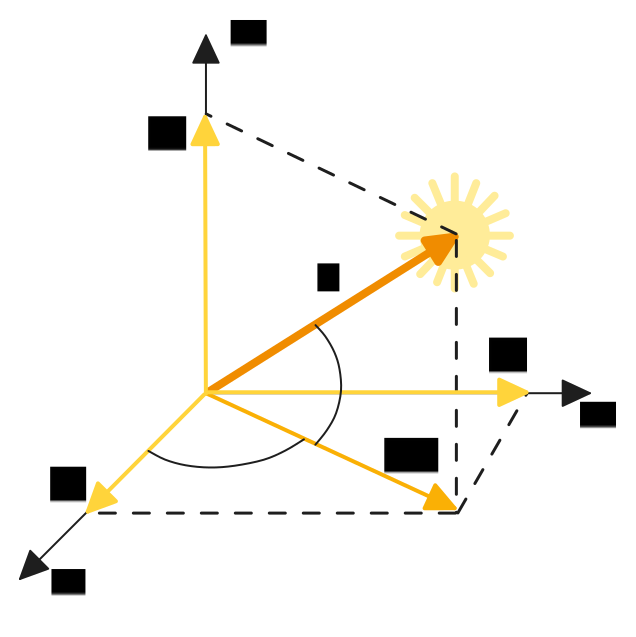

# 1. Введение

В предыдущей главе мы рассмотрели кинематику углового движения космического аппарата - то есть, как описывать ориентацию спутника во времени с помощью различных математических параметров. В данной главе мы перейдем от **описания** к **определению** ориентации - разберем, как на практике можно вычислить текущее угловое положение аппарата в пространстве на основе данных с датчиков.

## 1.1. Основные подходы

Существует два основных подхода к решению задачи определения ориентации:

1) **Статическое определение ориентации**

   Предполагается, что измерения со всех датчиков получены в один и тот же момент времени. Необходимо определить ориентацию спутника в этот конкретный момент, решив соответствующую геометрическую задачу.

2) **Динамическое определение ориентации** 

   В этом случае измерения поступают в течение некоторого промежутка времени. Для объединения этих разнородных данных применяются методы фильтрации и оценки, такие как **фильтр Калмана**, позволяющие получить устойчивую и точную оценку ориентации во времени.

В данной главе мы сосредоточимся исключительно на **статическом** определении ориентации. Подробно рассмотрим метод **TRIAD** как один из наиболее простых и наглядных алгоритмов, а также упомянем более сложные, но широко применяемые методы, основанные на численной оптимизации.

## 1.2. Почему одного датчика недостаточно

Прежде чем перейти к конкретным алгоритмам, ответим на важный вопрос:  
**Почему одного датчика часто недостаточно для определения ориентации в пространстве? Почему требуется использовать несколько?**

* **Во-первых**, все датчики подвержены погрешностям. Совмещение информации от нескольких источников позволяет повысить точность итоговой оценки ориентации.

* **Во-вторых**, большинство датчиков предоставляют неполную информацию об ориентации. Как правило, они позволяют определить только направление на объект (например, на Солнце или Землю), но не могут определить поворот вокруг этого направления.

Рассмотрим пример с **солнечным датчиком** (принцип его работы показан на рисунке ниже). Он измеряет направление на Солнце $\overline{s} = (s_1,\ s_2,\ s_3)$ в связанной системе координат спутника. Это эквивалентно знанию двух углов ориентации - $\alpha$ и $\beta$. Однако поворот аппарата вокруг вектора $\overline{s}$ остается неопределенным: как бы спутник ни вращался вокруг оси, направленной на Солнце, показания датчика останутся неизменными. Это означает, что солнечный датчик не дает полной информации об ориентации.

Аналогичным образом работает и **магнитометр**, измеряющий вектор магнитной индукции магнитного поля Земли. Он фиксирует направление магнитного поля в связанной системе координат и дает информацию лишь о двух из трех необходимых параметров ориентации.

Таким образом, для однозначного определения пространственной ориентации необходимо использовать минимум два независимых датчика, каждый из которых измеряет свой вектор. На этой основе можно решить задачу восстановления ориентации в пространстве. 

Следует отметить, что существуют **звездные датчики**, которые способны определять ориентацию напрямую и с высокой точностью. В случае их использования одного такого датчика может быть достаточно. Однако даже при наличии звездного датчика использование дополнительных измерений от других сенсоров позволяет повысить надежность и точность оценки ориентации.
