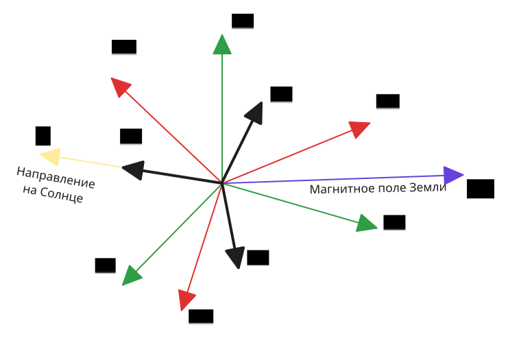

# 2. Метод TRIAD

Метод **TRIAD** (*Three-Axis Attitude Determination*) представляет собой один из наиболее простых и наглядных алгоритмов определения ориентации космического аппарата. Он основан на использовании двух независимых векторных измерений, полученных с бортовых датчиков, и соответствующих им опорных векторов, заданных в инерциальной системе координат (ИСК).

## 2.1. Исходные предпосылки

Предположим, что на спутнике установлены два датчика: солнечный датчик и магнитометр. Пусть аппарат оснащен навигационной системой, позволяющей определять его текущее положение. Тогда, зная орбитальные параметры, можно с высокой точностью вычислить:

- направление на Солнце в ИСК,
- направление вектора магнитной индукции земного магнитного поля по модели, например [IGRF](https://en.wikipedia.org/wiki/International_Geomagnetic_Reference_Field).

Таким образом, мы располагаем как измеренными векторами в ССК, так и соответствующими им вычисленными опорными векторами в ИСК.

## 2.2. Обозначения

Введем следующие обозначения:

|                          | Солнечный датчик          | Магнитометр               |
| ------------------------ | ------------------------- | ------------------------- |
| Измеренные векторы (ССК) | $\overline{s}^{\text{B}}$ | $\overline{m}^{\text{B}}$ |
| Опорные векторы (ИСК)    | $\overline{s}^{\text{I}}$ | $\overline{m}^{\text{I}}$ |

Предполагается, что все векторы нормированы (имею единичную длину). При необходимости нормализацию можно выполнить заранее.

Связь между измеренными и опорными векторами задается через матрицу поворота $\textbf{C}_{\text{I} \rightarrow \text{B}}$​, определяющую ориентацию спутника:

$$
\begin{matrix}
\overline{s}^{\text{B}} = \textbf{C}_{\text{I} \rightarrow \text{B}}\  \overline{s}^{\text{I}}, \\
\overline{m}^{\text{B}} = \textbf{C}_{\text{I} \rightarrow \text{B}}\  \overline{m}^{\text{I}}.
\end{matrix}
$$

## 2.3. Постановка задачи

Требуется определить матрицу ориентации $\textbf{C}_{\text{I} \rightarrow \text{B}}$​, опираясь на два вектора $\overline{s}$ и $\overline{m}$, известных одновременно в ССК и ИСК.

## 2.4. Этапы метода TRIAD

Метод **TRIAD** заключается в построении вспомогательной ортонормированной системы координат $\text{T}$ как в ССК, так и в ИСК, с последующим определением матрицы перехода между ними. 

### 2.4.1. Построение системы координат $\text{T}$

1) Первая ось $\overline{t}_1$ направляется вдоль одного из векторов. Например:

$$
\overline{t}_1 = \overline{s}.
$$

   На практике предпочтение следует отдавать тому вектору, который измеряется более надежным или точным датчиком. В нашем случае это солнечный датчик, поскольку магнитное поле может меняться, например, под воздействием солнечных вспышек.

2) Вторая ось $\overline{t}_2$ строится ортогонально к обоим векторным измерениям:

$$
\overline{t}_2 = \dfrac{\overline{s} \times \overline{m}}{\left|\overline{s} \times \overline{m}\right|}.
$$

   Следует учитывать, что при коллинеарности векторов $\overline{s}$ и $\overline{m}$ векторное произведение равно нулю, и построение оси $\overline{t}_2$ становится невозможным.

3) Третья ось $\overline{t}_3$ дополняет систему координат до правой:

$$
\overline{t}_3 = \overline{t}_1 \times \overline{t}_2.
$$

Построим такие тройки векторов как в ССК:

$$
\begin{cases}
\overline{t}_1^{\text{B}}=\overline{s}_1^{\text{B}}, \\ 
\overline{t}_2^{\text{B}} = \dfrac{\overline{s}^{\text{B}} \times \overline{m}^{\text{B}}}{\left|\overline{s}^{\text{B}} \times \overline{m}^{\text{B}}\right|}, \\ 
\overline{t}_3^{\text{B}} = \overline{t}_1^{\text{B}} \times \overline{t}_2^{\text{B}},
\end{cases}
$$

и аналогично в ИСК:

$$
\begin{cases}
\overline{t}_1^{\text{I}}=\overline{s}_1^{\text{I}}, \\ 
\overline{t}_2^{\text{I}} = \dfrac{\overline{s}^{\text{I}} \times \overline{m}^{\text{I}}}{\left|\overline{s}^{\text{I}} \times \overline{m}^{\text{I}}\right|}, \\
\overline{t}_3^{\text{I}} = \overline{t}_1^{\text{I}} \times \overline{t}_2^{\text{I}}. 
\end{cases}
$$

### 2.4.2. Вычисление ориентации спутника

Далее формируются матрицы перехода от вспомогательной системы $\text{T}$ к ССК и ИСК, где векторы $\overline{t}_1, \overline{t}_2, \overline{t}_3$ выступают в качестве столбцов:

$$
\begin{matrix}
\textbf{C}_{\text{T} \rightarrow \text{B}} = \left( \overline{t}_1^{\text{B}},\ \overline{t}_2^{\text{B}},\ \overline{t}_3^{\text{B}} \right), \\
\textbf{C}_{\text{T} \rightarrow \text{I}} = \left( \overline{t}_1^{\text{I}},\ \overline{t}_2^{\text{I}},\ \overline{t}_3^{\text{I}} \right).
\end{matrix}
$$

Матрица ориентации $\textbf{C}_{\text{I} \rightarrow \text{B}}$ определяется как:

$$
\textbf{C}_{\text{I} \rightarrow \text{B}} = \textbf{C}_{\text{T} \rightarrow \text{B}} \textbf{C}_{\text{T} \rightarrow \text{I}}^T.
$$

На этом вычисление ориентации завершено.

## 2.5. Преимущества и ограничения метода TRIAD

**Преимущества:**

- **Простота реализации.** Метод не требует итерационных процедур или численной оптимизации.
- **Низкая вычислительная сложность.** Используются только базовые векторные и матричные операции.
- **Отсутствие необходимости в априорной информации.** Метод не требует начальной оценки.

**Ограничения:**

- Используются только два вектора, даже если на борту доступна информация от большего числа датчиков.
- Один из векторов (определяющий ось $\overline{t}_1$) оказывает приоритетное влияние на результат.
- Метод чувствителен к коллинеарности векторов: в случае малых углов между ними ориентация определяется с большой погрешностью.
